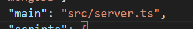

## mongoose
--> a powerful object data modeling (ODM) library for mongoDB

--> mongoose works like a wrapper for mongoDB, so it's called mongoDB wrapper

--> mongoose only works wwith mongoDB

--> It provides a higher-level abstraction for interacting with mongoDB, making it easier to work with data

--> with mongoose you can define schemas, models and relationship for your mongoDB documents

## why mongoose when there is mongoDB
--> mongoDB takes any type of data. we can keep different variation of a object ( obj with name ,same obj with name and id, again with name, id, email). so its tough to make query

--> mongoose makes the object more effecient, readable

## how mongoose works
--> mongoose stays connected with mongoDB. we see mongoose not mongoDB

--> when we do mapping an obj , mongoose helps to keep the data in mongoDB according to the mapping

--> if there is any property missing it will give an error

--> data will be added in the mongoDB with same structure

--> methods and properties of mongoDB are applicable to mongoose

   find()     findOne()    insertMany()    count()     update()

   delete()    save()      pupulate()      

   Statics,    instance methods    --> custom methods

## key features of mongoose
1. Schema defination
2. Model creation
3. Data Validation
4. Querying
5. Middleware Support  (in req, res)
6. Population  (in referance data)

## how mongoose works with typeScript
--> in ts, for data it needs type or interface

--> with that interface we need to create schema in mongoose

--> after that we creaate model

--> on that model we do query od database

interface ---> schema ---> model

# backend setup
1. npm init
2. give package name (mongoose-setup) and keep clicking enter
3. go to typescript --> get started --> download
4. npm install typescript --save-dev (install on development dependency)

5. go to express  documentation
6. npm install express --save (already dev dependency is there)

7. go to mongoose documentation
8. npm install mongoose --save

9. get the hello world example code from express
10. open a src folder
11. open a server.ts file in the src folder and paste the  copied code
12. go to ts-node-dev
13. npm i ts-node-dev --save-dev
14. go to github docmentation of ts-node-dev or from the usage option
15. add "tsnd --respawn server.ts" inside script
16. define the server folder path

17. now try "npm run dev"  (ts won't allow nodemon command as it's an node.js related command)
18. in server "const mongoose = require('mongoose')"
19. add the main function from mongoose

20. call the main() funcion to run
21. better keep the main function inside try and catch

22. npx tsc --init
23. in package json change main 

## organize the code
1. open app.ts
2. all app related things will be there except the app.listen, as app will be listened after the database connection
3. typoes for cors and express wont be there so we need to install 3rd party type definition
4. npm i --save-dev @types/cors
5. npm i --save-dev @types/express 

## next:NextFunction
a function that is used to pass control from one middleware to the next

to know details search the npm and search for express package or cors

## app.use(express.urlencoded({extended: true}))
app.use(): This is a method used to add middleware to an Express application. Middleware is a function that processes incoming requests before they reach your route handler.

express.urlencoded():This is a built-in middleware function in Express that parses the URL-encoded data (typically coming from a form submission) into a JavaScript object.